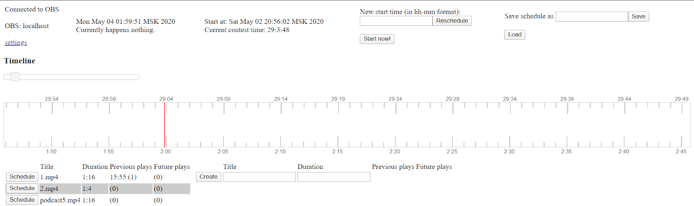

## Pre-requirements
- Windows
- browser
- OBS (not in studio mode)
- PowerShell with administrator rights
- JDK/JRE & JRE_HOME environment variable (JRE_HOME\bin\java.exe should exist)
- ffmpeg available from command line / PATH 

## Installation
1) Download install.ps1 and obs-thrift-api.dll from the latest plugin release.
2) Copy obs-thrift-api.dll into [OBS home]\plugins folder of your OBS installation https://obsproject.com/forum/threads/how-to-install-obs-plugins.4912/ 
3) Place install.pd1 script into an empty folder to install web interface tools into and run install.pd1 from windows powershell
4) Open powershell as administrator and run ```Set-ExecutionPolicy unrestricted```to adjust powershell security settings to run the script 
5) Script will download and install apache tomcat and ```obs-video-scheduler.zip```
6) As a result, installation folder should contain ```apache-tomcat-9.0.33``` ```data``` ```install.ps1``` and ```run.bat```

## Usage
1) Run OBS
2) Create or select a scene to add scheduled videos to
3) Run ```run.bat``` from scheduler folder
4) Open http://localhost:8080/ in browser
5) Web interface should show “Connected to OBS” in the upper left corner.



6) To schedule a video press ```schedule``` button to the left of video name in the lower left corner
7) Drag-n-drop video in the timeline to adjust start time (only round number of seconds allowed)
8) Double click on scheduled video to remove
9) Move the slider above the timeline to adjust zoom
10) Timeline has two timers available: global astronomic time (below timeline) and time from a given start time. To adjust start time use “New start time” and “Reschedule” button or click “Start now”
11) http://localhost:8080/comm will show information about upcoming video 1 minute before the video start and during the video

## Settings
You can open settings on the “settings” link in upper left corner of web interface or directly on http://localhost:8080/settings.jsp; settings are stored in ```\data\config.json```
### OBS
OBS host : localhost by default, but can target OBS on another computer available through local network
Video directory on OBS host: C:/videos/ folder with all videos
### Scheduler
Video directory on the server C:/videos/
Scene name: Scene1; scene name to add video to (should exist!)
Source name: Scheduled Video; source name to add video to (should *not* exist)
Source layer: 0; video source will be set to that layer number; 0 -- on top of all; used to add logos on top of the video
### Video dimensions
Top margin (px) 0
Left margin (px) 0
Width (%) 100
Height (%) 100
### Advanced
Sources to mute/unmute
Disclaimer file name: intro.mp4; video within video directory on OBS host that will be used as intro and outro before and after each video
